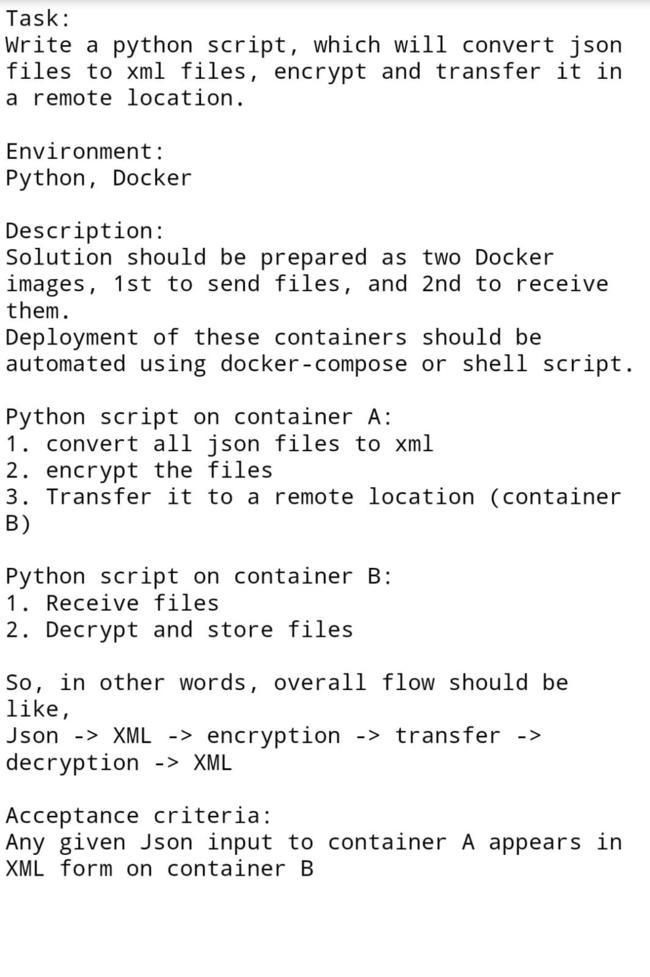

# A Devops Task

### Description 
Docker framework with Python script to convert json to xml, encrypt and transfer between containers


{:height="50%" width="50%"}

### How to
- Drop the json file(s) in src folder
- Start the containers
```
$ docker-compose up
```
- Verify the xml file(s) [with both encrypted and decrypted] in dest folder
